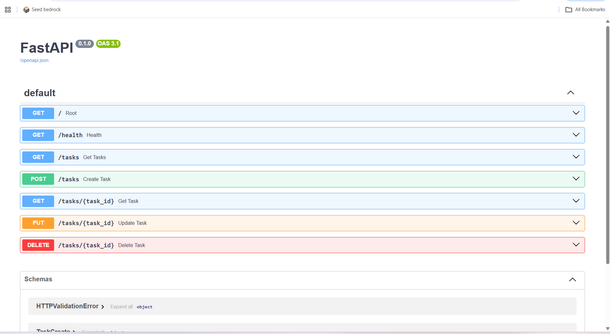

# Task CRUD API

A simple FastAPI project that manges a to-do list using CRUD operations.

This API allows users to create, read, update, and delete tasks. The project uses in-memory storage and includes automatic Swagger UI documentation provided by FastAPI.

## Installation

1. Clone the repository:

```bash
git clone <repository-url>
```

2. Navigate to the project folder:

```bash
cd week-02-crud-api
```

3. Create a virtual environment:

```bash
python -m venv .venv
```

4. Activate the virtual environment:

**Windows (PowerShell):**

```powershell
.\.venv\Scripts\Activate.ps1
```

5. Install the required packages:

```bash
pip install fastapi uvicorn
```

## Running the API

Start the server with:

```bash
uvicorn main:app --reload
```

The API will be available at:

- API: `http://localhost:8000`
- Swagger UI: `http://localhost:8000/docs`

## API Endpoints

| Method | Endpoint | Description |
|--------|----------|-------------|
| GET | `/` | Returns basic information about the API. |
| GET | `/health` | Checks if the API is running. |
| GET | `/tasks` | Returns all tasks. |
| GET | `/tasks/{task_id}` | Returns a task by its ID. |
| POST | `/tasks` | Creates a new task. |
| PUT | `/tasks/{task_id}` | Updates an existing task. |
| DELETE | `/tasks/{task_id}` | Deletes a task. |

## Example Request

Example using `curl` to retrieve all tasks:

```bash
curl -i http://localhost:8000/tasks
```

Example response:

```http
HTTP/1.1 200 OK
content-type: application/json

[
  {
    "id": 1,
    "title": "Buy milk",
    "done": false
  },
  {
    "id": 2,
    "title": "Complete internship assignment",
    "done": false
  }
]
```

