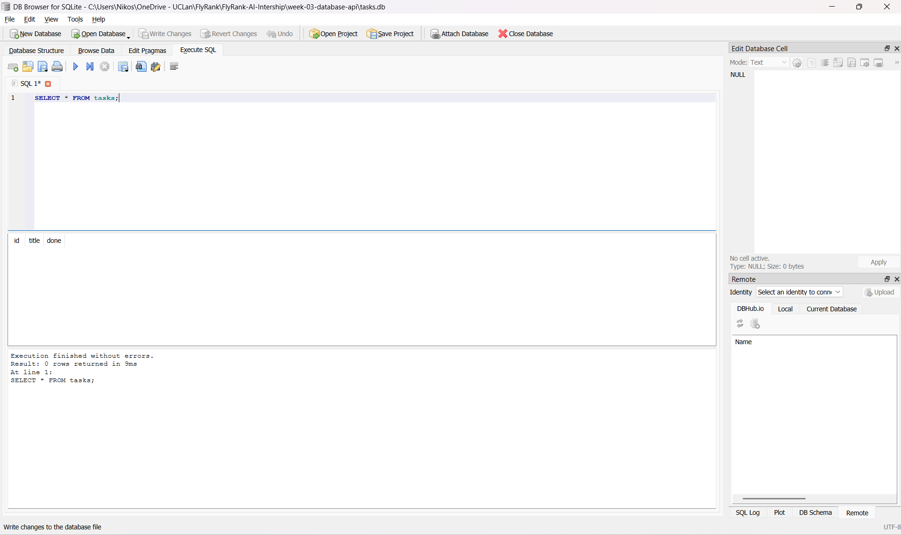

# Task CRUD API with SQLite

This project extends the original FastAPI CRUD API by replacing the in-memory task list with a SQLite database.

The API endpoints remain the same, but tasks are now stored persistently so they survive server restarts.

## Why SQLite?

SQLite was chosen because it is lightweight, simple to use, and does not require a seperate database server. It stores the database in a single file, which make it suitable for a beginner backend project while still providing real data persistence.

## Database

The application uses a SQLite database named:

'tasks.db'

The database file is inside the 'week-03-database-api' folder.

When the application is run for the first time, it automatically creates the database and the 'tasks' table. Three example tasks are also added on the first run.

## How to Run the Project

1. Open a terminal inside the `week-03-database-api` folder.

2. Install the required packages:

   ```bash
   pip install fastapi uvicorn

3. Start the FastAPI server:

   uvicorn main:app --reload

4. Open the Swagger UI in your browser:

   http://127.0.0.1:8000/docs

The API and SQLite database are now ready for use.

## Example SQL Query

During development, I used DB Browser for SQLite to inspect and modify the database directly.

For example, this query returns all completed tasks:

```sql
SELECT * FROM tasks WHERE done = 1;

This demonstrated how SQL can filter rows using a WHERE clause and allowed me to verify the results against the FastAPI GET /tasks endpoint.

## Database Screenshot

The `tasks` table viewed using DB Browser for SQLite:



## Author

Nikos Paul Williams